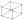
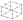
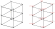
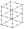

# Assembly of Elemental Matrices in the Finite Element Method (FEM)

## Description

The assembly of elemental matrices is a critical step in FEM, allowing the construction of global system equations from the individual properties of each element. This project focuses on the indexing technique, which uses connectivity matrices to identify and place each element’s contributions in the correct locations within the global structure. This approach is more efficient compared to direct summation, particularly for large-scale systems.
### 8-Node Isoparametric hexahedral Element

The 8-node isoparametric hexahedral element is defined by nodes positioned at each corner of the cubic element, as follows 



#### Shape functions

The shape functions for the 8-node element are defined as:

$$
N_i(\xi, \eta, \zeta) = \frac{1}{8} (1 + \xi_i \xi)(1 + \eta_i \eta)(1 + \zeta_i \zeta)
$$

where $i$ is the node indice.

### 20-Node Isoparametric hexahedral Element

The 8-node isoparametric hexahedral element is defined by nodes positioned at each corner of the cubic element, as follows 



#### Shape functions

The shape functions for the 8-node element are defined as:

- For nodes 1 to 8:
  
$$
N_i(\xi, \eta, \zeta) = \frac{1}{8} (1 + \xi_i \xi)(1 + \eta_i \eta)(1 + \zeta_i \zeta)(\xi_i \xi + \eta_i \eta + \zeta_i \zeta -2)
$$ 

- For nodes 9, 11, 13 and 15:

$$
N_i(\xi, \eta, \zeta) = \frac{1}{4}(1 - \xi^2)(1 + \eta_i \eta)(1 + \zeta_i \zeta)
$$

- For nodes 10, 12, 14 and 16:

$$
N_i(\xi, \eta, \zeta) = \frac{1}{4}(1 + \xi_i \xi)(1 - \eta^2)(1 + \zeta_i \zeta)
$$

- For nodes 17 to 20:

$$
N_i(\xi, \eta, \zeta) = \frac{1}{4}(1 + \xi_i \xi)(1 + \eta_i \eta)(1 - \zeta^2)
$$

## Node Distribution in the Structure

The nodes in the structure are numbered in a specific order for consistency and clarity. The numbering scheme follows these guidelines:

1. **Top to Bottom**: Nodes are numbered starting from the top layer of the structure and proceeding downwards.
2. **Left to Right**: Within each layer, nodes are numbered from the left side to the right side.
3. **Back to Front**: For multi-layer structures, the numbering continues from the back of the structure to the front.

This systematic approach ensures that each node has a unique identifier, making it easier to reference them in the mathematical formulations and the finite element analysis (the elements in the global structure are numbered following the same idea).

Below is a visual representation of the node distribution in the structure, where the numbering of the degrees of freedom (in $x$, $y$, and $z$) for each node of the 8-node element is indicated in red (DOFs of the 20-node elements are numbered following the same idea).




Note that the Cartesian coordinates of the first node of the 8-node element are `(-1,-1,-1)`, while the global coordinates of the first node would be `(-Lx/2, Ly/2, -Lz/2)`.

## Indexing Global Matrices

To index the global matrices, a matrix of degrees of freedom (`edofMat`, as it is called in the code) is utilized. This matrix contains the degrees of freedom for each node, following the numbering scheme of the structure. The degrees of freedom are organized in the order of the node positions for each element.

Below is shown how the matrix would look for the 8-node element.

```matlab
edofMat = 4 5 6 13 14 15 10 11 12 1 2 3 22 23 24 31 32 33 28 29 30 19 20 21;
          7 8 9 16 17 18 13 14 15 4 5 6 25 26 27 34 35 36 31 32 33 22 23 24];
```

Elements are placed below this line of the matrix.

Kronecker matrix product is applied between the index matrix `edofMat` and a unit vector of length $n$ (24 for the 8-node and 60 for the 20-node element), followed by a reshaping operation. 

```matlab
iS = reshape(kron(edofMat,ones(24,1))',24*24*nele,1);
jS = reshape(kron(edofMat,ones(1,24))',24*24*nele,1);
```
or

```matlab
iS = reshape(kron(edofMat,ones(60,1))',60*60*nele,1);
jS = reshape(kron(edofMat,ones(1,60))',60*60*nele,1);
```
where `nele` is the number of elements of the global structure.

The resulting vectors (`iS` and `jS`) are structured so that the indices $iS(t)$ and $jS(t)$ correspond to the (i, j)th entry of the stiffness and inertia matrix for element $e$, where $t = i + 8(j − 1) + 64(e − 1)$. The third vector is obtained by reshaping the elementar intertia and stiffness matrices. 

```matlab
kK = reshape(KE(:)*E*x(:)',24*24*nele,1);
kM = reshape(ME(:)*rho*x(:)',24*24*nele,1);
```
or
```matlab
kK = reshape(KE(:)*E*x(:)',60*60*nele,1);
kM = reshape(ME(:)*rho*x(:)',60*60*nele,1);
```
where E and rho are the Young's modulus and mass density, while `x`is 

```matlab
x = ones(nely, nelx, nelz);
```
with `nelx`, `nely`and `nelz`as the number of elements in the $x$, $y$ and $z$ axes.

Finally, the global matrices are given by 
```matlab
K = sparse(iS,jS,kK); K = (K + K')/2;
M = sparse(iS,jS,kM); M = (M + M')/2;
```

## Validation 


## References
The theory and implementation of the finite element method used in this project are based on concepts from the book Introduction to Finite Element Vibration Analysis by Maurice Petyt. This book provides a comprehensive understanding of finite element formulations and their application to vibration analysis.


