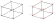

# Assembly of Elemental Matrices in the Finite Element Method (FEM)

## Description

The assembly of elemental matrices is a critical step in FEM, allowing the construction of global system equations from the individual properties of each element. This project focuses on the indexing technique, which uses connectivity matrices to identify and place each element’s contributions in the correct locations within the global structure. This approach is more efficient compared to direct summation, particularly for large-scale systems.
### 8-Node Isoparametric hexahedral Element

The 8-node isoparametric hexahedral element is defined by nodes positioned at each corner of the cubic element, as follows 

#### Shape functions

The shape functions for the 8-node element are defined as:

$$
N_i(\xi, \eta, \zeta) = \frac{1}{8} (1 + \xi_i \xi)(1 + \eta_i \eta)(1 + \zeta_i \zeta)
$$

where $i$ is the node indice.

### 20-Node Isoparametric hexahedral Element

The 8-node isoparametric hexahedral element is defined by nodes positioned at each corner of the cubic element, as follows 

#### Shape functions

The shape functions for the 8-node element are defined as:

- For nodes 1 to 8:
  
$$
N_i(\xi, \eta, \zeta) = \frac{1}{8} (1 + \xi_i \xi)(1 + \eta_i \eta)(1 + \zeta_i \zeta)(\xi_i \xi + \eta_i \eta + \zeta_i \zeta -2)
$$ 

- For nodes 9, 11, 13 and 15:

$$
N_i(\xi, \eta, \zeta) = \frac{1}{4}(1 - \xi^2)(1 + \eta_i \eta)(1 + \zeta_i \zeta)
$$

- For nodes 10, 12, 14 and 16:

$$
N_i(\xi, \eta, \zeta) = \frac{1}{4}(1 + \xi_i \xi)(1 - \eta^2)(1 + \zeta_i \zeta)
$$

- For nodes 17 to 20:

$$
N_i(\xi, \eta, \zeta) = \frac{1}{4}(1 + \xi_i \xi)(1 + \eta_i \eta)(1 - \zeta^2)
$$

## Node Distribution in the Structure

The nodes in the structure are numbered in a specific order for consistency and clarity. The numbering scheme follows these guidelines:

1. **Top to Bottom**: Nodes are numbered starting from the top layer of the structure and proceeding downwards.
2. **Left to Right**: Within each layer, nodes are numbered from the left side to the right side.
3. **Back to Front**: For multi-layer structures, the numbering continues from the back of the structure to the front.

This systematic approach ensures that each node has a unique identifier, making it easier to reference them in the mathematical formulations and the finite element analysis.

Below is a visual representation of the node distribution in the structure, where the numbering of the degrees of freedom (in \( x \), \( y \), and \( z \)) for each node is indicated in red.

  

  

